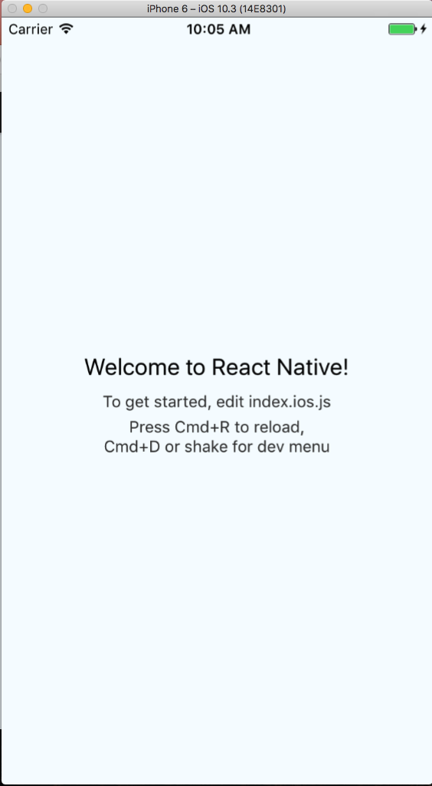

# Introduction


Starting the project

`react-native init DogApp`

At the end you should see something like this

```
To run your app on iOS:
   cd /Users/robertrupp/Developer/DogApp
   react-native run-ios
   - or -
   Open ios/DogApp.xcodeproj in Xcode
   Hit the Run button
To run your app on Android:
   cd /Users/robertrupp/Developer/DogApp
   Have an Android emulator running (quickest way to get started), or a device connected
   react-native run-android
```

Run your application

* IOS
`react-native run-ios`



* Android


## Outline

1. Folders & Files
2. Controls & Layout
3. Getting Data
4. Styling
5. Navigation (using packages)
6. Bonus (shake gesture)